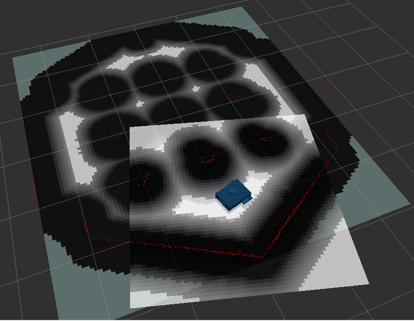

# ROS 2 Mobile Robot Simulation Stack

## Project Overview
This repository contains a complete simulation stack for a differential drive mobile robot built in ROS 2. The robot is designed from scratch using URDF/Xacro, equipped with a LiDAR and an RGB camera, and deployed in an Ignition Gazebo simulation environment. The Navigation2 (Nav2) stack is integrated to enable autonomous waypoint navigation.

## Features
- ✅ URDF/Xacro model for differential drive robot
- ✅ Sensor integration: 360-degree LiDAR, RGB camera, and IMU
- ✅ Simulated in Ignition Gazebo
- ✅ Manual teleoperation using `/cmd_vel`
- ✅ Odometry publication via `/odom`
- ✅ Fully integrated Nav2 stack with SLAM and waypoint navigation

## Deliverables

1. URDF modeling and link/joint validation 
2. Sensor integration and RViz visualization 
3. Ignition Gazebo simulation and spawner setup 
4. Nav2 integration and navigation testing 

## Directory Structure
```
.
├── config/
│   ├── diff_drive_controller_velocity.yaml
│   ├── ekf.yaml
│   └── nav2_params.yaml
├── launch/
│   ├── display.launch.py
│   └── robot.launch.py
├── models/
│   └── (Ignition Gazebo models)
├── rviz/
│   ├── urdf_config.rviz
│   └── navigation_config.rviz
├── urdf/
│   └── robot.xacro
├── worlds/
│   └── empty.world
```

## Building the Robot and Required Plugins

To build and simulate the robot, ensure the following components are properly set up:

1. **URDF/Xacro**:
   - The robot is described using a modular Xacro file (`urdf/robot.xacro`).
   - It includes base chassis, wheels, a caster, LiDAR, RGB camera, and IMU.

2. **Controllers and ROS 2 Control**:
   - Uses `ros2_control` framework with the `diff_drive_controller` plugin.
   - Velocity commands are sent via `/cmd_vel`, and odometry is published on `/odom`.
   - Configuration located in `config/diff_drive_controller_velocity.yaml`.

3. **Gazebo Simulation**:
   - The robot is spawned in Ignition Gazebo using launch files and the `ros_gz_sim` package.
   - Simulation plugins for sensors and control are configured inside the Xacro.
   - Lidar uses the `gpu_lidar` plugin, and camera uses the `camera` plugin.

4. **Sensor Integration**:
   - **LiDAR**: 360-degree horizontal scan, published to `/scan`.
   - **Camera**: RGB image and camera info published to `/robot_cam` and `/camera_info`.
   - **IMU**: Provides orientation and angular velocity data for localization.

5. **ROS 2 Bridges**:
   - Uses `ros_gz_bridge` to interface between Ignition Gazebo and ROS 2.
   - Bridges topics such as `/scan`, `/imu`, `/robot_cam`, and `/clock`.

6. **Localization & Navigation**:
   - EKF node from `robot_localization` for sensor fusion (optional).
   - SLAM Toolbox and Nav2 stack for map building and navigation.
   - Parameters are configured in `config/ekf.yaml` and `nav2_params.yaml`.


To view the robot in Gazebo, run the following commands:
```bash
cd ~/ros2_ws
colcon build --symlink-install
source install/setup.bash

ros2 launch dd_robot display.launch.py
```
This will not launch the navigation packges, but you will be able to view the robot in Gazebo and RViz2.


Make sure all required plugins are installed via appropriate ROS 2 packages and Gazebo plugins. Refer to the **Requirements** section below. Add topics in gazebo using the Add button in the bottom right corner.

## Step-by-Step Execution

### Step 1: Build the workspace
Run the following commands to build your ROS 2 workspace:
```bash
cd ~/ros2_ws
colcon build --symlink-install
source install/setup.bash
```

### Step 2: Launch the full simulation stack
Launch the robot, simulation world, and Nav2 stack:
```bash
ros2 launch dd_robot robot.launch.py
```

This launches:
- Ignition Gazebo with your robot model
- RViz2 for visualization
- SLAM Toolbox and Nav2 stack for localization and planning

### Step 3: Send waypoints to the robot
After the stack is running, execute the custom node to make the robot follow waypoints:
```bash
ros2 run dd_robot follow_waypoints.py
```

This node commands the robot to follow predefined waypoints using the Nav2 action interface.




## Notable Implementation Details
- **URDF/Xacro**: Modular and parameterized Xacro file defining robot geometry, joints, and sensors.
- **Gazebo Plugins**: Integration of `gz_ros2_control`, IMU, camera, and LiDAR plugins.
- **Nav2 Stack**: Uses `navigation_launch.py` and `online_async_launch.py` from `nav2_bringup` and `slam_toolbox` respectively.
- **Bridging**: ROS <-> Ignition topics bridged using `ros_gz_bridge`.

## Requirements
- ROS 2 Humble
- Ignition Gazebo Fortress
- Packages:
  - `nav2_bringup`
  - `slam_toolbox`
  - `ros_gz_sim`
  - `robot_localization`
  - `robot_state_publisher`

## Final Outcome
- Fully functional simulation environment with odometry, localization, and autonomous navigation in a Gazebo world using Nav2.
- Robot can navigate to waypoints selected in RViz2, with all major topics and controllers operational.

## References
- [URDF Robot Tutorial by Dimitris Katos](https://github.com/DimitrisKatos/dd_robot/tree/master)
- [Ignition ROS 2 Integration Tutorial](https://docs.ros.org/en/foxy/Tutorials/Advanced/Simulators/Ignition/Ignition.html)
- [Nav2 on Real TurtleBot3 Tutorial](https://docs.nav2.org/tutorials/docs/navigation2_on_real_turtlebot3.html)

---

**Author**: Kushal Shah  
**License**: [MIT](LICENSE)

---

>Contributions, issues, and pull requests are welcome!

